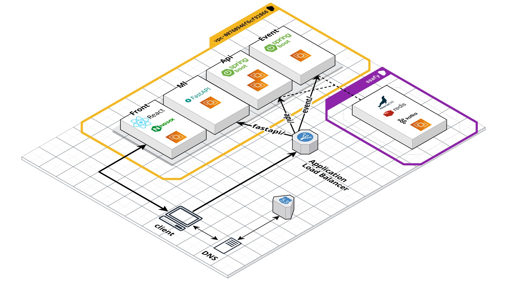

# 키워드기반 일기메이트 추천 서비스


### 안녕하세요! SSAFY 8기 광주 자율 프로젝트 광주 2반 강혜성없는 강혜성팀 입니다.!


> # 1. 기획배경
> ```
> 안녕하세요! 저희 팀은 취향, 키워드 기반 일기메이트 추천 서비스 버디어리를 소개해드리겠습니다.
>
> 많은 사람들이 일기를 쓰는것도 시간이고 굳이 필요성을 못느끼는 사람이 많다고 생각합니다
> 하지만 개발자들이 TIL을 통해 성장하듯이, 일기를 통해 오늘 있었던일을 정리하고 자기성찰을 통한 내적 성장을 할 수 있습니다.
> ```
>
> 
> 
> 
> ```
> 박보영씨가 일기를 열심히 쓰는거로 굉장히 유명하다고 합니다.
> 다음은 실제로 박보영씨가 작성한 일기인데요.
> "이런 상황에서 못하는것은 부끄러운 일이라고 생각했는데 그 일을 내가 저지르고 말았다.."
> 연기를 하다가 본인에게 굉장히 실망했었던 일이 있었는데 박보영씨는 이 일을 일기에 적음으로써 스트레스가 많이 풀렸다고 합니다
>
> 여러분 예전에 교환일기 다들 써보셨나요?
> 앞선 사례처럼 혼자서 일기를 쓰는것만으로도 스트레스가 풀릴 수도 있지만, 누군가 내 얘기를 들어주는 것만으로도 큰 힘이 나는 경우도 있고, 혹은 좋은일이 있었는데 자신과 성향이 비슷한 누군가와 공유하고 싶은 순간이 있습니다.
>
> 그런 분들을 위해 기획한게 저희 버디어리 입니다 !
> ```


<br> <br> <br> <br>

> # 2. 서비스 소개
> > ## 완전 반응형
> >   ```
> >   기본적으로 저희 버디어리는 완전 반응형으로 구현되어 있습니다
> >   PC,패드,모바일 언제 어디에서나 저희 버디어리를 사용하실 수 있도록 어떠한 환경에서도 일관적인 디자인을 제공해드립니다
> >   ```
> >   
> >   
> <br> <br> <br> <br>
> > ## OAuth 로그인
> > ```
> > 저희는 그룹일기의 접근성을 위해 OAuth를 통한 카카오톡 회원가입과 로그인을 구현하였습니다
> > 단순 OAuth가 아닌 시큐리티와 결합하여 표준화된 OAuth를 구현했습니다.
> > 저희 서비스에 로그인하시게 되면 jwt 인증 필터를 통해 1차적으로 요청이 중간이 변조, 탈취되었는지 확인할 수 있습니다.
> > 덕분에 안전하게 서비스 제공을 할 수 있으며 카카오톡 알람을 통한 그룹일기 초대 메세지를 보낼 수 있습니다.
> > ```
> > 
> > 
> > 
> <br> <br> <br> <br>
> > ## 메인 페이지
> > ```
> > 메인 페이지는 풀페이지로 섹션별로 구성되어있으며
> > 여러 애니메이션을 통해 버디어리를 소개해드리고 있습니다.
> > ```
> > 
> > {섹션 B gif}
> > 
> > 
> <br> <br> <br> <br>
> > ## 실시간 알람
> > ```
> > 저희는 SSE를 통한 실시간 알람을 전송해드립니다.
> > 1:1 채팅 요청을 받을 때, 본인이 속한 그룹에 새 글이 올라왔을 때 메세지가 전송됩니다
> > Web Socket은 양방향으로 데이터를 주고받을 수 있지만 SSE를 사용하게 되면 클라이언트는 데이터를 받기만 합니다.
> > SSE는 별도의 프로토콜을 사용하지 않고 HTTP 프로토콜만으로 사용할 수 있기 때문에 Web Socket 에 비해 훨씬 가볍기도 하고 저희 프로젝트 특성상 웹소켓보다 SSE를 사용하는게 더 적합하다고 판단해 SSE를 사용하게 되었습니다.
> > ```
> > 
> > 
> <br> <br> <br> <br>
> > ## 취향 기반 유저 추천
> > ```
> > 최초 회원가입시 진행했던 설문조사를 토대로 랜덤의 익명 유저와 자신과의 유사도를 비교하여 확인하실 수 있습니다
> > 저희는 spring 서버와 fast api서버가 분리 되있는데 fastapi서버에선 최초 회원가입시 진행하는 설문조사의 답변을 기반으로 tf-idf 및 코사인 유사도 계산 과정을 거쳐 다른 유저와의 유사도를 보여줍니다.
> > ```
> > 
> <br> <br> <br> <br>
> > ## 키워드 기반 유저 추천
> > ```
> > 취향 기반 추천은 랜덤의 유저라면, 키워드 기반 유저 추천은 본인이 작성했던 일기를 기반으로 자신과 비슷한 키워드를 주제로 일기를 작성한 유저들을 추천하는 방식입니다.
> > 일기 작성 시 soynlp를 활용해 키워드를 추출 후 단어의 빈도수와 비례한 키워드 점수 형태로 저장하여 마찬가지로 tf-idf 및 코사인 유사도 계산 과정을 거쳐 키워드가 비슷한 유저를 추천하게됩니다.
> > ```
> > { 키워드 기반 유저 추천.jpg}
> <br> <br> <br> <br>
> > ## 감정 분석
> > ```
> > 저희는 유저가 사용했던 일기의 감정분석을 제공해드리고 있습니다.
> > 유저가 일기를 쓰게 되면 AI를 통해 감정을 분석해서 그 결과를 다이어리의 해당 날짜에 이모티콘 형태로 보여주게됩니다.
> > ```
> > { 달력 감정.jpg }
> <br> <br> <br> <br>
> > ## 스티커
> > ```
> > 유저가 방을 만들거나 일기를 작성하게되면 포인트를 얻게 되는데 해당 포인트로 저희가 직접 제작한 스티커를 상점을 통해 구매하여 이용하실 수 있습니다.
> > ```
> > 
> <br> <br> <br> <br>
> > ## 그룹일기
> > ```
> > 카카오톡 초대를 통해 원하는 사람과 그룹일기를 만들 수 있습니다
> > 그룹에 속한 인원을 볼 수 있고
> > 해당 그룹에 올라온글에 반응과 댓글을 남길 수 있습니다.
> > 또한 남의 다이어리에 스티커를 붙일 수 있습니다
> > ```
> >{ 그룹일기 반응 + 댓글 gif }
> <br> <br> <br> <br>
> > ## 일기 작성
> > ```
> > 유저는 텍스트와 사진을 첨부하여 일기를 작성할 수 있고 해당 일기를 원하는 그룹에 동시에 올릴 수 있습니다.
> > 혹은 아무것도 선택하지 않고 개인일기에만 저장할 수 있습니다
> > 일기 작성이 마무리 되고 나면 가지고 있는 스티커를 원하는 위치에 붙일 수 있습니다.
> > ```
> > 
> > 
> <br> <br> <br> <br>
> > ## 마이페이지
> > ```
> > 프로필 수정을 통해 프로필 이미지와 닉네임과 소개글을 수정할 수 있고 설문조사를 다시 할 수 있습니다
> > 달력에 본인이 작성한 날짜에 감정 이모지와 본인이 일기에 자주 쓰는 키워드들은 크게, 많이 사용하지 않은 단어들은 작게 워드 클라우드를 제공해줍니다
> > 또한 일기를 작성한 날짜의 이모티콘을 확인하여 그 날의 일기 디테일을 볼 수 있습니다.
> > ```
> > { 마이페이지.jpg }

<br> <br> <br> <br>

> # 3. 시스템 아키텍쳐
> > ```
> > 저희는 향후에 서비스 규모가 커진다고 가정하였을 때를 고려하여 어플리케이션 로드 밸런서를 사용하여 http 트래픽에 대해 로드 밸런싱을 하기 때문에 경로를 확인하고 해당 서버에 적절하게 트래픽을 분배 할 수 있었습니다.
> > ```
> > 

<br> <br> <br> <br>

> # 4. 팀원 소개
> > 