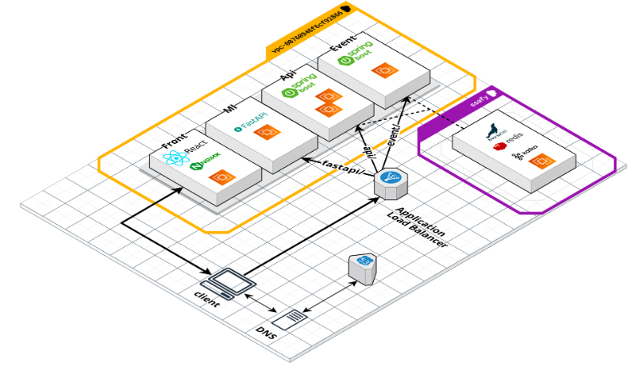

# 포팅 문서

Status: 결과물

# 개발 환경

### 형상관리

- GitLab

### 이슈 관리

- Jira

### 사용 OS

- Windowe
- Ubuntu 20.04

### Communitcaion

- Notion
- Mattermost

### UI/UX

- Figma

### Server

- AWS EC2 M6I.large
    - cpu 2
    - 30g storage

### DataBase

- Maria-db

### IDE

- Visuial Studio Code
- IntelliJ

## FrontEnd

- react
- react qury
- redux
- Tail wind.css
- node 18.12.1

## DataEnd

- fastapi(backend)
- sklearn
- soynlp
- colab
- 

## BackEnd

- Java11
- gradle
- SpringSecurity
- Redis
- Kafka
- Spring Data JPA
- JPQL
- Oauth2

---

# 인프라 구성



## EC2 m6i.large 6개

- 프론트 서버 1개api 백엔드 2개
- event 백엔드 1개
- ML 서버 1개
- 래디스,카프카, 마리아 디비 1개

## ALB 구성

- 리스너를 3개를 구분지어 api, event, ml 로 구성 했습니다.
    
    
    
- 80 에 대한 룰을 다음과 같이 정의해 경로기반 리스너  라우팅을 진행했습니다.
    
    
    

각 리스너 그룹의 구성은 다음과 같습니다

- eventGroup
    
    
    
- apiBackENd
    - 쿠키를 활용한 jwt 인증 인가를 진행하기 때문에 stickey 옵션을 활성화 했습니다.
    
    
    
- fastGroup
    
    
    

## aws S3 구성

- 버킷 생성
    
    
    
- 객체 소유권 ACL 활성화 설정
    
    
    
- 퍼블릭 엑세스 차단 설정 해제
    
    
    
- IAM 계정 생성 > IAM 콘솔에서 사용자를 추가
    
    
    
- Amazon S3 Full Access 권한 부여
    
    
    
- IAM > 보안 자격 증명에서 엑세스 키를 발급하여 .yml 설정 파일에 추가
    
    ```bash
    #Amazon S3
    cloud:
      aws:
        region:
          static: S3를 서비스할 region 명 (서울 : ap-northeast-2)
        s3:
          bucket: 버킷이름
        credentials:
          access-key: 발급받은 access-key
          secret-key: 발급받은 secret-key 
        stack:
          auto: false
    ```
    

---

# CD/CI 환경 구현

- ci 는 gitlab webhcock 과 젠킨스를 활용해 진행했습니다.
- cd 구현은 젠킨스의 ssh publish 를 활용해 백엔드는 nohup, 프론트는 빌드파일을 nginx 로 전달했습니다.

### 젠킨스 내부설정

1. ssh 설정
    1. 발급받은  pem키, 서버  설정
    
    
    
    
    
2. credentail 설정
    1. userNameWithPassword
        1. gitlab id  password 등록
            
            
            
3. ****Global Tool Configuration/****Node 18.12.1설정
    
    
    

### 젠킨스 아이템 설정

젠킨스 파이프라인은SCM 을 활용 했으며 gitlab repository 안 jenkins  에 존재합니다.
각각 프론트는 `front.jenkinsfile`, ml 서버는 `fast.jenkins`  벡엔드는 `back.jenkinsfile` 로 존재합니다 세개의 젠킨스 아이템이 존재하며 각각 프론트, 벡엔드 를 담당합니다. 


두 아이탬 모두 파이프라인 scm 설정은 동일하게 진행하면 자동으로 git lab 에 있는 파이프라인 스크립틀 읽어오는 형태로 구성 했습니다.

1. 파이프 라인 설정
    1. 빌드 트리거 설정
        
        
        
    2. **pipeline scm**, **RepositoryURL**, **Branches to build(SCM 읽어올 브랜치)
    , Script Path(scm 파일경로) 설정**
        
        
        

### Backend Pipeline 구성

- jenkins 파일
    
    ```groovy
    pipeline {
        agent any
    
        stages {
            stage('checkout') {
                steps {
    				checkout scmGit(branches: [[name: '*/release']],
    				 extensions: [],
    				  userRemoteConfigs: [[credentialsId: 'mj',
    				   url: 'https://lab.ssafy.com/s08-final/S08P31C202.git']])
                }
            }
    		stage('build') {
                steps {
    				dir('back') {
    					withGradle {
    						sh 'chmod +x ./gradlew'
    						sh './gradlew clean'
    						sh './gradlew bootJar'
    					}
    				}
                }
            }
    		stage('publish_1') {
                steps {
    				dir('back/build/libs') {
    					sshPublisher(publishers: [sshPublisherDesc(configName: 'back1', transfers: [sshTransfer(cleanRemote: false, excludes: '', 
    					execCommand: '''cd /home/ubuntu/jenkins_build 
    					kill -9 `cat save_pid.txt`
    					rm save_pid.txt
    					nohup java -jar buddiary-0.0.1-SNAPSHOT.jar > logs/buddiary.log 2>&1 &
    					echo $! > save_pid.txt''', execTimeout: 120000, flatten: false, makeEmptyDirs: false, noDefaultExcludes: false, patternSeparator: '[, ]+', remoteDirectory: '', remoteDirectorySDF: false, removePrefix: '', sourceFiles: 'buddiary-0.0.1-SNAPSHOT.jar')], usePromotionTimestamp: false, useWorkspaceInPromotion: false, verbose: false)])
    				}
                }
            }
    		stage('publish_2') {
    			steps {
    				dir('back/build/libs') {
    					sshPublisher(publishers: [sshPublisherDesc(configName: 'back2', transfers: [sshTransfer(cleanRemote: false, excludes: '', 
    					execCommand: '''cd /home/ubuntu/jenkins_build 
    					kill -9 `cat save_pid.txt`
    					rm save_pid.txt
    					nohup java -jar buddiary-0.0.1-SNAPSHOT.jar > logs/buddiary.log 2>&1 &
    					echo $! > save_pid.txt''', execTimeout: 120000, flatten: false, makeEmptyDirs: false, noDefaultExcludes: false, patternSeparator: '[, ]+', remoteDirectory: '', remoteDirectorySDF: false, removePrefix: '', sourceFiles: 'buddiary-0.0.1-SNAPSHOT.jar')], usePromotionTimestamp: false, useWorkspaceInPromotion: false, verbose: false)])
    				}
    			}
    		}
    		stage('event') {
    			steps {
    				dir('back/build/libs') {
    					sshPublisher(publishers: [sshPublisherDesc(configName: 'event', transfers: [sshTransfer(cleanRemote: false, excludes: '', 
    					execCommand: '''cd /home/ubuntu/jenkins_build 
    					kill -9 `cat save_pid.txt`
    					rm save_pid.txt
    					nohup java -jar buddiary-0.0.1-SNAPSHOT.jar > logs/buddiary.log 2>&1 &
    					echo $! > save_pid.txt''', execTimeout: 120000, flatten: false, makeEmptyDirs: false, noDefaultExcludes: false, patternSeparator: '[, ]+', remoteDirectory: '', remoteDirectorySDF: false, removePrefix: '', sourceFiles: 'buddiary-0.0.1-SNAPSHOT.jar')], usePromotionTimestamp: false, useWorkspaceInPromotion: false, verbose: false)])
    				}
    			}
    		}
        }
    }
    ```
    

### FastApi Pipeline 구성

- jenkins 파일
    
    ```groovy
    pipeline {
        agent any
        environment {
            FASTAPI_IMAGE_NAME = "manduthecat/buddiary-fastapi"
            IMAGE_TAG = "1.0"
            DOCKERHUB_CREDENTIALS= credentials('mandu_docker')
            TARGET_HOST = "ubuntu@15.165.32.147"
        }
        stages {
            stage('checkout') {
                steps {
    				checkout scmGit(branches: [[name: '*/release']],
    				 extensions: [],
    				  userRemoteConfigs: [[credentialsId: 'mj',
    				   url: 'https://lab.ssafy.com/s08-final/S08P31C202.git']])
                }
            }
    
            stage('Login to Docker Hub') {      	
                steps{                       	
                    sh "echo $DOCKERHUB_CREDENTIALS_USR"
                    sh 'echo $DOCKERHUB_CREDENTIALS_PSW | docker login -u $DOCKERHUB_CREDENTIALS_USR --password-stdin'
                    echo 'Login Completed' 
                }
            }   
    		stage('build') {
                steps {
    				dir('fastapi') {
                        sh "ls -al"
                        sh 'docker build . -t ${FASTAPI_IMAGE_NAME}:${IMAGE_TAG}'
                        sh 'docker push ${FASTAPI_IMAGE_NAME}:${IMAGE_TAG}'
    				}
                }
            }
    		stage('publish') {
                steps {        
                    sshagent (credentials: ['fast']) {
                    sh """
                        ssh -o StrictHostKeyChecking=no ${TARGET_HOST} '
                            sudo docker stop buddiary-fastapi  || true && sudo  docker rm buddiary-fastapi || true && sudo docker rmi ${FASTAPI_IMAGE_NAME}:${IMAGE_TAG} || true
                            sudo docker run -d --name buddiary-fastapi -v /home/ubuntu/jenkins_build/static/:/code/docker_fastapi/static -p 80:9000 ${FASTAPI_IMAGE_NAME}:${IMAGE_TAG}
                        '
                    """
                    }
                }
            }
        }
    }
    ```
    

### Frontend Pipeline 구성

- jenkins 파일
    
    ```groovy
    pipeline {
        agent any
        stages {
            stage('checkout') {
                steps {
    				checkout scmGit(branches: [[name: '*/release']],
    				 extensions: [],
    				  userRemoteConfigs: [[credentialsId: 'mj',
    				   url: 'https://lab.ssafy.com/s08-final/S08P31C202.git']])
                }
            }
    		stage('build') {
                steps {
    				dir('front') {
                        withEnv(['CI=false']) {
                            nodejs('NodeJS 18.12.1') {
                            sh 'npm i --force'
                            sh 'npm run build'
                            sh 'pwd'
                            sh 'rm -rf front_build'
                            sh 'mv build front_build'
                            }
                        }				
    				}
                }
            }
    		stage('publish') {
                steps {
    				dir('front') {
                        echo 'hello'
                        sshPublisher(publishers: [sshPublisherDesc(configName: 'front', transfers: [sshTransfer(cleanRemote: false, excludes: '', execCommand: '', execTimeout: 120000, flatten: false, makeEmptyDirs: false, noDefaultExcludes: false, patternSeparator: '[, ]+', remoteDirectory: '/buddiary', remoteDirectorySDF: false, removePrefix: '', sourceFiles: 'front_build/')], usePromotionTimestamp: false, useWorkspaceInPromotion: false, verbose: false)])
    				}
                }
            }
        }
    }
    ```
    

---

# 프론트 환경 구현

- 래포지토리 clone
    
    ```bash
    git clone https://lab.ssafy.com/s08-final/S08P31C202.git
    ```
    
- 내부로 이동
    
    ```bash
    cd S08P22C202/front
    ```
    
- 연관라이브러리 설치
    
    ```bash
    npm i --force
    ```
    
- 개발 서버 실행
    
    ```bash
    npm start
    ```
    

---

# Fast API 환경 구현

- 내부로 이동(로컬)
    
    ```bash
    cd S08P31C202/fastapi/docker_fastapi
    
    로컬 환경 실행 시 (local_fastapi)
    ```
    
- docker 파일 설정
    
    ```bash
    FROM python:3.11
    
    WORKDIR /code
    
    COPY ./requirements.txt /code/requirements.txt
    
    RUN pip install --no-cache-dir --upgrade pip && \
    pip install --no-cache-dir --upgrade setuptools && \
    pip install --no-cache-dir --upgrade -r /code/requirements.txt
    
    COPY ./docker_fastapi /code/docker_fastapi
    
    CMD ["uvicorn", "docker_fastapi.main:app", "--host", "0.0.0.0", "--port", "9000"]
    ```
    
- 가상환경 설정
    
    ```jsx
    python -m venv venv
    source venv/Scripts/activate
    pip install -r requirements.txt
    ```
    
- 서버 실행
    
    ```jsx
    uvicorn main:app --reload --port 9000
    
    (9000 자리에 원하는 포트번호를 입력)
    ```
    

---

# 백엔드 환경 구현

### EC2에 docker 설치

- ec2 접속
    
    ```bash
    ssh -i K8C202T.pem c202.pem https://k8c202.p.ssafy.io/
    ```
    
- 패키지 업데이트
    
    ```bash
    sudo yum update -y
    ```
    
- docker 설치
    
    ```bash
    sudo yum install docker -y
    ```
    
- 설치한 Docker 버전 확인
    
    ```bash
    docker -v
    ```
    
- docker 실행
    
    ```bash
    sudo service docker start
    ```
    
- docker 그룹에 sudo 추가 (인스턴스 접속 후 도커 바로 제어할 수 있도록)
    
    ```bash
    sudo usermod -aG docker ec2-user
    ```
    
- 인스턴스 재접속 후 Docker 명령어 실행해보기
    
    ```bash
    docker run hello-world
    ```
    

### maria-db 구성

- docker에 redis 설치
    
    ```bash
    docker run --name maria-db -d -p 3306:3306 --restart=always -e MYSQL_ROOT_PASSWORD=buddiary_c202! mariadb --lower_case_table_names=1
    ```
    

### EC2 maria-db 외부 접속 허용

- maria-db docker 우분투에 접속
    
    ```bash
    docker exec -it maria-db bash
    ```
    
- 라이브러리 설치 및 수정
    
    ```bash
    apt-get update
    apt-get install -y vim
    cd /etc/mysql/mariadb.conf.d
    vim 50-server.cnf
    ```
    
    
    
    
    
- 주석 해제 후 mysql 재시작
    
    ```bash
    service mysql restart
    ```
    

### maria-db 개인 계정 및 database 생성

- maria-db 컨테이너에 명령 실행
    
    ```bash
    docker exec -it maria-db mysql -u root -p
    // 비밀번호 입력
    ```
    
- MySQL로 전환
    
    ```bash
    use mysql;
    ```
    
- 새로운 database 생성
    
    ```bash
    create database IF NOT EXISTS `buddiary`;
    ```
    
- 계정 생성
    
    ```bash
    CREATE USER 'user_id'@'%' identified by 'passaord';
    ```
    
- 접속을 허용할 User를 Host 정보와 함께 Insert
    
    ```bash
    INSERT INTO user (Host, User) VALUES ('%', 'user_id');
    ```
    
- MySQL에 대한 모든 권한을 부여
    
    ```bash
    GRANT ALL PRIVILEGES ON *.* TO 'user_id'@'%'IDENTIFIED BY 'passaord';
    ```
    
- 적용
    
    ```bash
    FLUSH PRIVILEGES;
    ```
    

### Redis 구성

- docker에 redis 설치
    
    ```bash
    docker pull redis
    docker run --name myredis -d -p 6379:6379 redis
    docker run -it --link myredis:redis --rm redis redis-cli -h redis -p 6379
    ```
    
- redis 비밀번호 설정
    
    ```bash
    // cli 접속
    docker exec -it myredis redis-cli
    // 비번 설정
    CONFIG SET requirepass "buddiary_c202!"
    // 확인
    127.0.0.1:6379> AUTH buddiary_c202!
    // OK
    127.0.0.1:6379> ping
    PONG
    ```
    

### Kafka와 Zookeeper 구성

- Git clone
    
    ```bash
    git clone [https://github.com/wurstmeister/kafka-docker.git](https://github.com/wurstmeister/kafka-docker.git)
    ```
    
- 클론 폴더에서 docker-compose.yml 아래와 같이 수정
    
    ```bash
    version: '2'
    services:
      zookeeper:
        image: wurstmeister/zookeeper
        container_name: zookeeper
        ports:
          - "2181:2181"
        restart: unless-stopped
    
      kafka:
        build: .
        image: wurstmeister/kafka
        container_name: kafka
        ports:
          - "9092:9092"
        environment:
          DOCKER_API_VERSION: 1.22
          KAFKA_ADVERTISED_HOST_NAME: 3.36.56.145
          KAFKA_ZOOKEEPER_CONNECT: zookeeper:2181
          KAFKA_MESSAGE_MAX_BYTES: 10000000
          KAFKA_AUTO_CREATE_TOPICS_ENABLE: 'true'
          KAFKA_DELETE_TOPIC_ENABLE: 'true'
        volumes:
          - /var/run/docker.sock:/var/run/docker.sock
        restart: unless-stopped
    ```
    
- 해당 폴더에서 명령어 실행
    
    ```bash
    docker-compose up -d
    ```
    

### 백엔드 실행

- 벡엔드 경로 이동
    
    ```bash
    cd S08P31C202/back
    ```
    
- application.yml
    
    ```groovy
    spring:
      profiles:
        group:
          "local": "local, jwt, oauth"
        active: local
    server:
      name: local
      port: 8080
    ---
    #Amazon S3
    cloud:
      aws:
        region:
          static: S3를 서비스할 region 명 (서울 : ap-northeast-2)
        s3:
          bucket: 버킷이름
        credentials:
          access-key: 발급받은 access-key 
          secret-key: 발급받은 secret-key 
        stack:
          auto: false
    spring:
      config:
        activate:
          on-profile: "local"
      jpa:
        hibernate:
          # 로컬에선 create update 가능
          ddl-auto: none
        properties:
          hibernate:
            show_sql: true
            format_sql: true
            dialect: org.hibernate.dialect.MySQL5InnoDBDialect
        generate-ddl: true
        open-in-view: false
      datasource:
        ## 계정 과 주소는 각자 맞춰서 해주세요
        driver-class-name: com.mysql.cj.jdbc.Driver
        password: buddiary_c202!
        url: jdbc:mysql://k8c202.p.ssafy.io:3306/buddiary?useUnicode=true&serverTimezone=Asia/Seoul
        username: root
      kafka:
         bootstrap-servers: 3.36.56.145:9092
      redis:
        lettuce:
          pool:
            max-active: 10
            max-idle: 10
            min-idle: 2
        port: 6379
        host: 3.36.56.145
        password: 'buddiary_c202!'
    logging:
      level:
        org:
          springframework:
            security: TRACE
    ```
    
- application-jwt.yml
    
    ```groovy
    jwt:
      token:
        secret: 
        access:
          expiration: 3600000000 # 1시간(60분) (1000L(ms -> s) * 60L(s -> m) * 60L(m -> h))
          header: Authorization
        refresh:
          expiration: 1209600000 #  (1000L(ms -> s) * 60L(s -> m) * 60L(m -> h) * 24L(h -> 하루) * 14(2주))
          header: Authorization-refresh
    ```
    
- application-oauth.yml
    
    ```groovy
    spring:
      security:
        oauth2:
          client:
            registration:
              google:
                client-id: 구글 클라이언트 ID
                client-secret: 구글 클라이언트 Secret
                scope: profile, email
    
              naver:
                client-id: 네이버 클라이언트 ID
                client-secret: 네이버 클라이언트 Secret
                redirect-uri: http://localhost:8080/login/oauth2/code/naver (설정한 redirect URI)
                authorization-grant-type: authorization_code
                scope: name, email, profile_image
                client-name: Naver
    
              kakao:
                client-id: 
                client-secret: 
                redirect-uri: http://localhost:3000/login/oauth2/code/kakao
                client-authentication-method: POST
                authorization-grant-type: authorization_code
                scope:
                  - profile_nickname
                  - profile_image
                  - account_email
                client-name: Kakao
    
            provider:
              naver:
                authorization_uri: https://nid.naver.com/oauth2.0/authorize
                token_uri: https://nid.naver.com/oauth2.0/token
                user-info-uri: https://openapi.naver.com/v1/nid/me
                user_name_attribute: response
    
              kakao:
                authorization-uri: https://kauth.kakao.com/oauth/authorize
                token-uri: https://kauth.kakao.com/oauth/token
                user-info-uri: https://kapi.kakao.com/v2/user/me
                user-name-attribute: id
    ```
    
- 해당 경로로 ide 실행